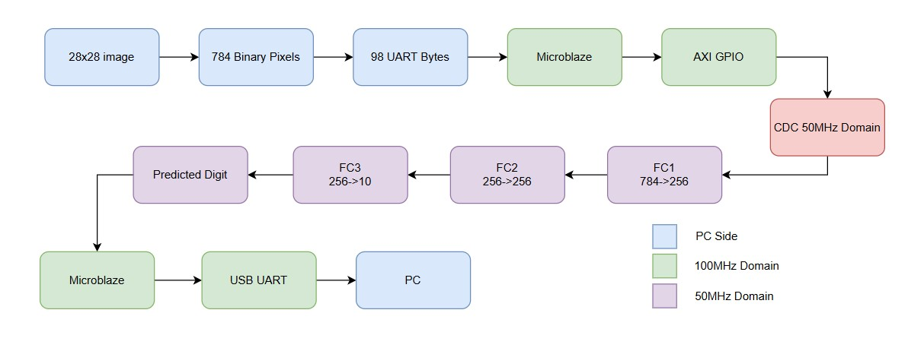
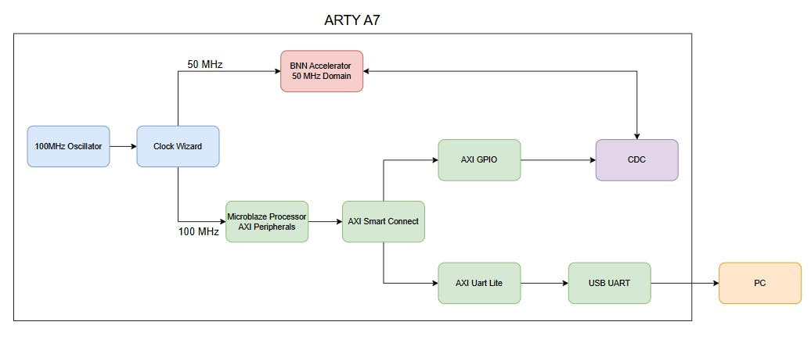
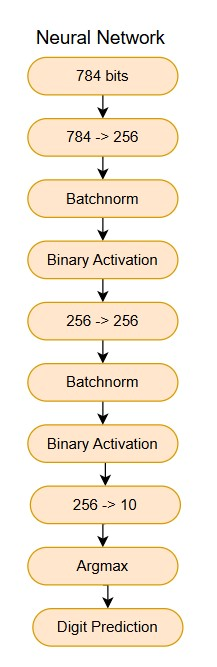
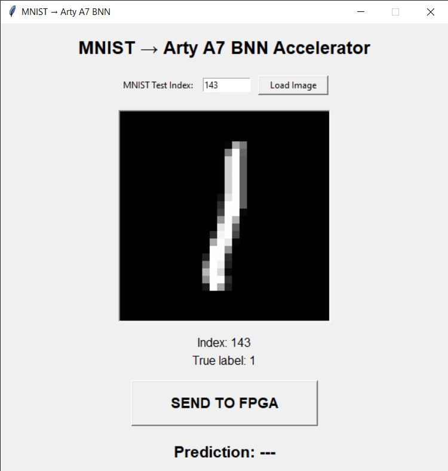
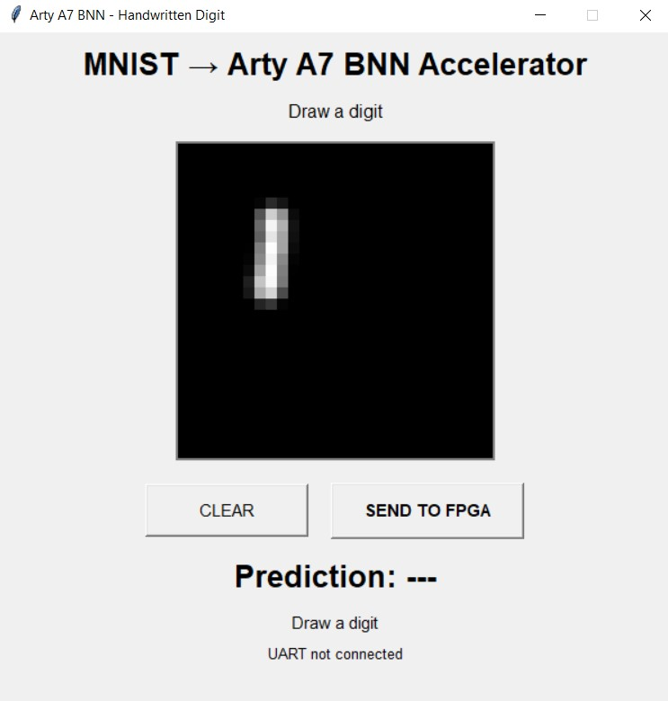
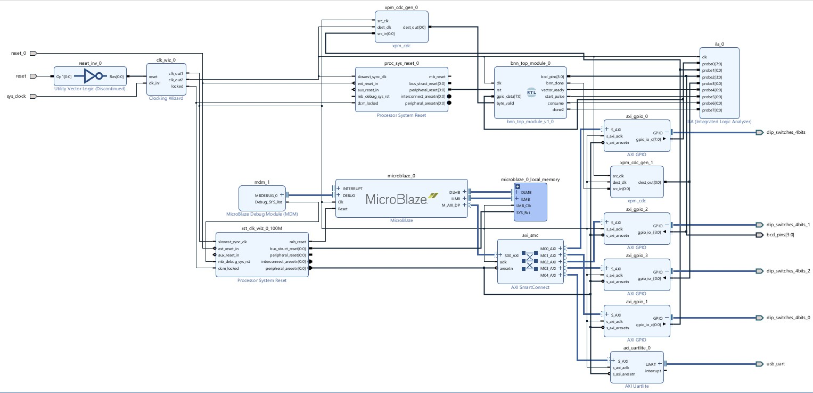
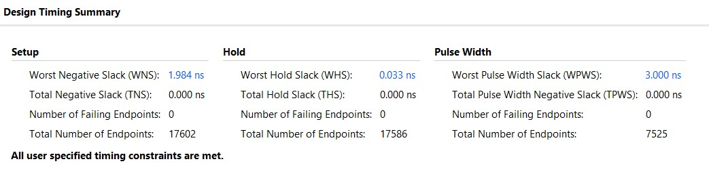
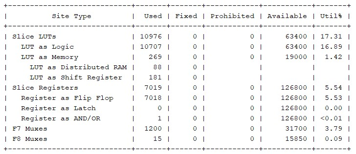

# MNIST Binary Neural Network Accelerator on Arty A7

A hardware-accelerated Binary Neural Network (BNN) for MNIST digit classification, implemented on the **Digilent Arty A7-100T FPGA** using **Verilog, Vivado, Vitis, MicroBlaze, AXI peripherals, and Python**.

The system receives a binarized 28×28 MNIST image from a PC over UART, performs inference in FPGA hardware using XNOR + population count operations, and returns the predicted digit.

---

## Project Overview

The implemented BNN consists of three fully-connected layers:

```text
784 → 256 → 256 → 10
```

The first two layers use binary weights, XNOR-popcount computation, and BatchNorm threshold folding. The final layer performs classification using an argmax operation.



---

## Hardware

- **FPGA:** Digilent Arty A7-100T
- **FPGA Family:** Xilinx Artix-7
- **Processor:** MicroBlaze
- **System Clock:** 100 MHz
- **BNN Clock:** 50 MHz
- **UART:** AXI UARTLite
- **Interconnect:** AXI SmartConnect
- **GPIO:** AXI GPIO
- **Debug:** Native Xilinx ILA
- **Tools:** Vivado 2025.1 / Vitis 2025.1
- **CD4511:** BCD to 7 Segment Decoder
- **Display:** 7 Segment Display



---

## Neural Network



Binary matrix multiplication is implemented using:

```text
XNOR → Population Count → Integer Score
```
-1s in the input image and weights are mapped to 0. So the multiplication required is obtained as per the logic of XNOR.
For a vector of width `N`:

```text
Score = 2 × PopCount(XNOR(input, weight)) − N
```

This allows binary layers to be implemented without conventional multipliers.

---

## AXI / MicroBlaze Interface

Four AXI GPIO peripherals are used:

| GPIO | Width | Function |
|------|------:|----------|
| GPIO0 | 8-bit | Image byte |
| GPIO1 | 1-bit | Byte valid |
| GPIO2 | 4-bit | BCD prediction |
| GPIO3 | 1-bit | BNN done |

The MicroBlaze processor communicates with the BNN through AXI GPIO.

The image contains:

```text
28 × 28 = 784 binary pixels
```

The pixels are packed into:

```text
784 bits = 98 bytes
```

The FPGA reconstructs the original 784-bit vector before starting inference.

---

## Clock Domain Crossing

The MicroBlaze/AXI system operates at **100 MHz**, while the BNN operates at **50 MHz**.
Large adder tree implemented by the Vivado tool requires more time to be completed so the WNS is satisfied by a 50MHz clock.

The image/control interface therefore crosses between clock domains.

```text
100 MHz Domain
     │
     │ AXI GPIO
     ▼
gpio_data[7:0]
byte_valid
     │
     ▼
    CDC
     │
     ▼
50 MHz BNN Domain
```

The `byte_valid` signal is synchronized and edge-detected in the BNN clock domain.

Each rising edge of the synchronized valid signal causes exactly one byte to be captured.

The image shift register collects all 98 bytes:

```text
98 × 8 = 784 bits
```

After the final byte is received:

```text
vector_ready = 1
```

This generates a one-cycle:

```text
start_pulse
```

which starts BNN inference.

After inference is complete, the BNN generates:

```text
bnn_done = 1
```

and the prediction is available on:

```text
bcd_pins[3:0]
```

---

## UART Communication

UART configuration:

```text
Baud Rate : 9600
Data Bits : 8
Parity    : None
Stop Bits : 1
```

The PC communicates with the MicroBlaze through the board's USB-UART interface.

Typical communication sequence:

```text
PC → FPGA : READY request
FPGA → PC : READY

PC → FPGA : 98 image bytes

FPGA       : BNN inference

FPGA → PC : Prediction
```

---

## Python Interface

Python is used for:

- Designing a software reference model used throughout the development for functional verification of each layer.

- MNIST dataset loading
- Image preprocessing
- Pixel binarization
- 784-bit → 98-byte conversion
- UART communication
- FPGA prediction retrieval
- Automated accuracy testing
- Interactive handwritten-digit input

A Tkinter GUI is also provided for drawing handwritten digits and sending them directly to the FPGA.

### GUI

<!-- Add your GUI screenshot here -->



Loading Test Image from MNIST Dataset using index.



Hand Draw digits.

---

## 📊 Vivado Block Design

<!-- Add your Vivado block design screenshot here -->



The main hardware blocks include:

- MicroBlaze
- AXI SmartConnect
- AXI GPIO
- AXI UARTLite
- Clocking Wizard
- Processor System Reset
- BNN accelerator
- CDC logic
- Native ILA

---

## Timing

The implemented design achieved positive timing slack.

```text
Worst Negative Slack (WNS): +1.984 ns
Total Negative Slack (TNS):  0.000 ns

Worst Hold Slack (WHS):     +0.033 ns
Total Hold Slack (THS):      0.000 ns

```

The BNN operates at 50 MHz to provide timing margin for the XNOR/popcount datapaths.

<!-- Add timing report screenshot here -->



---

## Power & Utilization

The following are the Power and Utilization reports of the design 




---
## 📈 Accuracy

The Python reference implementation achieved approximately:

```text
~86% MNIST test accuracy
```

The current FPGA implementation achieves approximately:

```text
~78% MNIST test accuracy
```

The complete hardware inference and PC ↔ FPGA communication pipeline is functional.
Working towards increasing the accuracy of the FPGA implementation.
---


## Hardware Setup

<!-- Add your Arty A7 hardware photograph here -->


---


